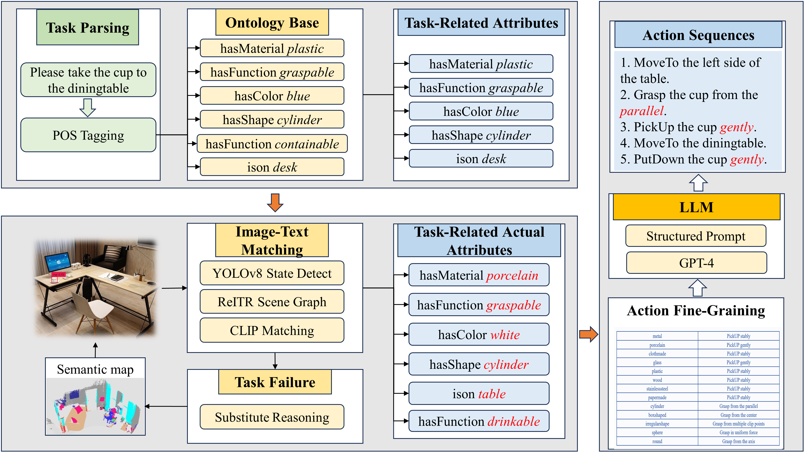
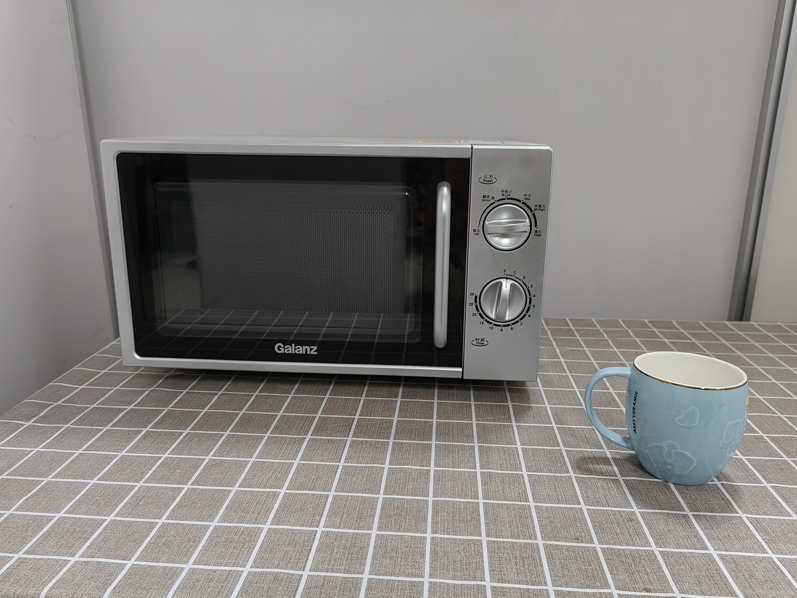
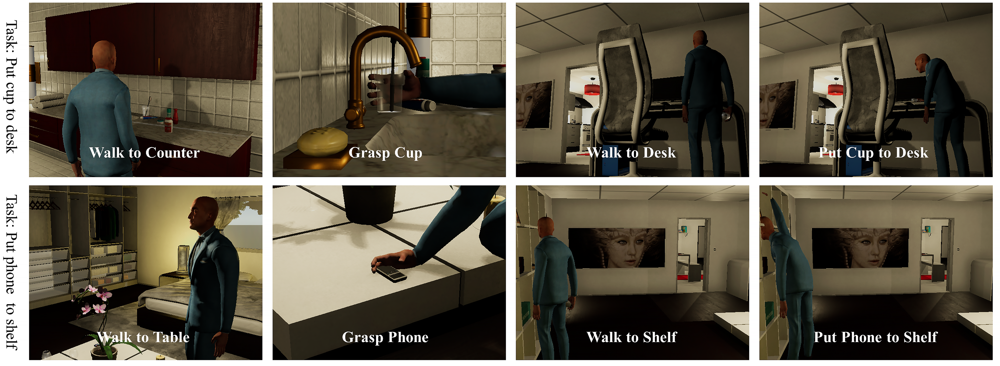

# Fine-Grained Task Planning for Service Robot Based on Object Ontology Knowledge via Large Language Models

**This code repository is the official resource for the paper "Fine-Grained Task Planning for Service Robot Based on Object Ontology Knowledge via Large Language Models." It comprehensively demonstrates the entire process of the FGTP (Fine-Grained Task Planning) framework. It is important to note that the home item ontology knowledge base used for construction in the paper is not included in this repository due to open-source limitations. As an alternative, we provide an ontology.json file, which structurally mimics the original ontology knowledge base. Readers can build their own knowledge base by referring to the structure of the knowledge base described in the paper and the sample content in the ontology.json file, combined with knowledge of ontology modeling.**




## 1. INSTALLATION

The models used in our project include [BERT](https://huggingface.co/bert-base-uncased), [YOLOv8](https://github.com/ultralytics/ultralytics), [ReITR](https://github.com/yrcong/RelTR), [CLIP](https://github.com/openai/CLIP), please install the environment of the corresponding model before use.


## 2.USAGE

Download the pre-trained model and place them in the **ckpt** directory in the root.

[YOLOv8 State Detection](https://drive.google.com/file/d/1gR2P04eCPyI8ji2IP1J1PDw7slyaDY2D/view?usp=drive_link)

[ReITR Scene Graph Generation](https://drive.google.com/file/d/1olw6NiTAWc0Sy5pefp_jv6nxPv1eRHO_/view?usp=drive_link)

Download the bert-base-uncased and place them in the **bert-base-uncased** directory in the root.

[bert-base-uncased](https://drive.google.com/drive/folders/10acnZGBS7avTrI-DAqiF1d4cC_5MlCgQ?usp=sharing)

After installing the runtime environment and downloading the pre-trained model, run **MainStandard.py**, which is the code for the standard task planning process, and note that you have to fill in your own **openai key** in line 14 of the code:

```
python MainStandard.py
```


The code for the anomaly task planning is in MainExceptional.py, and it is important to note that since there is no running of the actual robot involved in the open source code, the code for the semantic building and item searching portions of the original article is not available here, but rather it is assumed that the items can be directly replaced by finding a replacement.

```
python MainExceptional.py
```
## 3.RESULTS

The results of the run are saved in the results directory in the root directory, where **img_cropped.jpg** represents the image of the detected item cropped from the original image, **img_detected.jpg** represents the visualization image of the results of the target detection, and **StandardPlanning.txt** represents the results of the standard task planning, the **ExceptionalPlanning.txt** represents the result of abnormal task planning

|         image          |                 task                  | Task Planning                                                                                                                                                                                    |
|:----------------------:|:-------------------------------------:|:-------------------------------------------------------------------------------------------------------------------------------------------------------------------------------------------------|
|   | Please task the cup to the microwave  | 1. MoveTo the right side of the table. <br>2. Grasp the cup from the handle. <br>3. PickUp the cup stably. <br>4. Open the microwave. <br>5. PutDown the cup stably. <br>6. Close the microwave. |

## 4.SIMULATION EXPERIMENT

For more information about VirtualHome, please refer to: [VirtualHome](http://virtual-home.org/documentation/master/)




